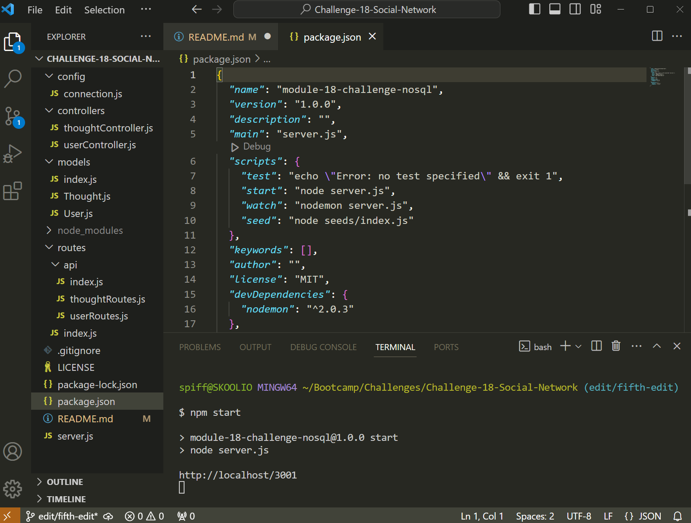

# Challenge 18 Social Network

## Description

This application can be used in managing a social media platform's database by letting users of this application create, read, update and delete users and their posted thoughts.

## Table of Contents
* [Description](#description)
* [Installation](#installation)
* [Usage](#usage)
* [Contributions](#contributions)
* [License](#license)
* [Questions and Contacts](#questions-and-contacts)

## Installation

[Visual Studio Code](https://code.visualstudio.com/), [GitBash](https://git-scm.com/downloads), [MongoDB](https://fastdl.mongodb.org/windows/mongodb-windows-x86_64-6.0.4-signed.msi) and [Node.js](https://nodejs.org/en) must be installed onto the user’s computer. The recommended version of Node.js 18.17.1 LTS.

[How to Install MongoDB](https://coding-boot-camp.github.io/full-stack/mongodb/how-to-install-mongodb)

Additional, installing Insomnia is recommended for exploring the CRUD functionality of this application. [Insomnia Download](https://insomnia.rest/download)

Once the required software has been successfully installed on the computer, clone this GitHub repository to a desired folder on the computer.

[The GitHub Repository of this Social Network Application](https://github.com/Hello-AndyJoe/Challenge-18-Social-Network)

The cloned repository does not include the node_module folder containing the Express or Mongoose NPMs. Install them into the repository by running `npm i` in a GitBash terminal within Visual Studio Code. 

## Usage

Open a GitBash Terminal within the cloned repository and run `npm start`.

Then you can open `http://localhost:3001/api/users` or `http://localhost:3001/api/thoughts` in Insomnia. The following video will showcase the use of the CRUD functionality.

[Video Showing the Social Network Database Usage](https://drive.google.com/file/d/1CwI8AKPld04yqY2KY7hlHPD6nlIgwkDp/view?usp=sharing)

## Contributions

Activity 11-Ins_Models-Schemas of Module 18 - NoSQL were used for reference in the creation of the models and server.js.

Activities 13 through 26 of Module 18 - NoSQL used for reference in creating the controllers and routes. 

[Mongoose v7.0.2](https://www.npmjs.com/package/mongoose/v/7.0.2) and its [documentation](https://mongoosejs.com/docs/guide.html) used in the creation of this application.

## License

MIT

## Questions and Contacts
Visit other repositories created by me at [github.com/hello-andyjoe](https://github.com/hello-andyjoe)

If you have questions, please email me at [andrew.joseph.roper@gmail.com](mailto:andrew.joseph.roper@gmail.com)